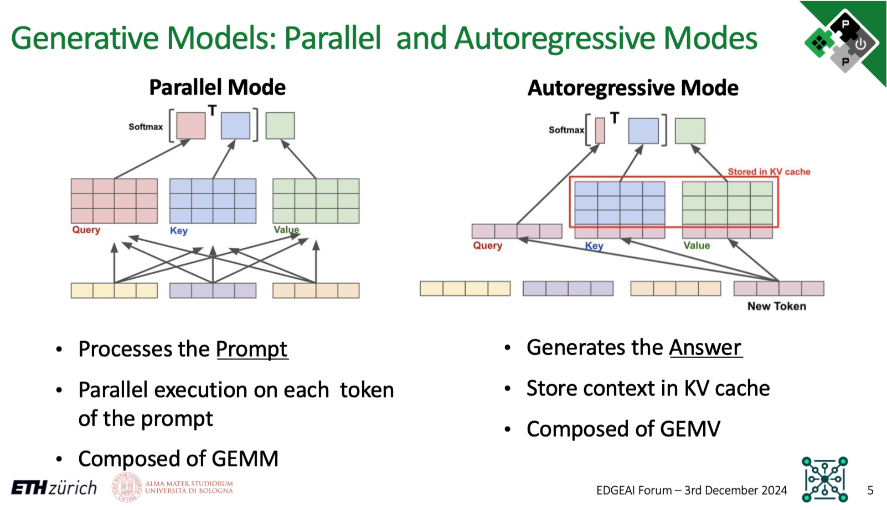
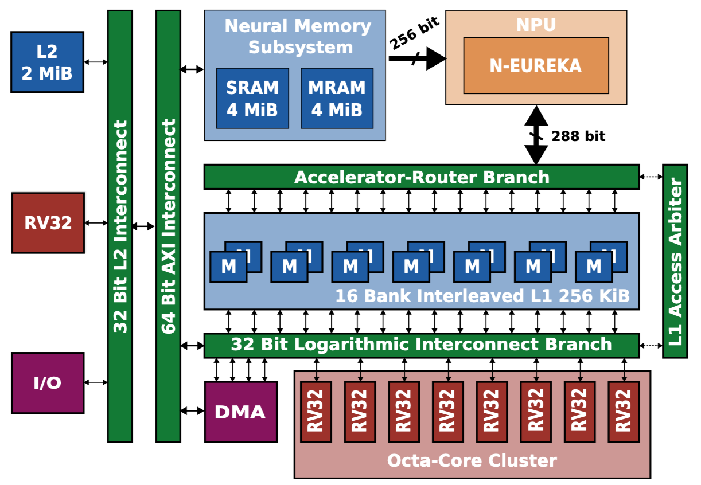

<div style="display: flex; justify-content: space-between; align-items: center;">
  
  <div style="text-align: right;">
    <p>Institut für Integrierte Systeme <br>
    Integrated Systems Laboratory</p>
  </div>
</div>


# SoCDAML: Neural Network Deeployment on the PULP Platform
Author: *Victor J.B Jung* <br>
Date: 27th May 2025

## Installation

A Singularity container with Deeploy and its dependencies has been installed on your home directory, it should be a folder named `DeeployContainer`. You can find the `Deeploy` source code under `~/DeeployContainer/app/Deeploy`.

To enter a shell from the container, from your home, simply run `singularity shell --writable --cleanenv --contain DeeployContainer`. Then you can naviguate to the `DeeployTest` folder with `cd /app/Deeploy/Deeploytest`.

From the `DeeployTest` folder you can use the `testRunner` to compile ONNXs and execute the output code with the appropriate simulators.

To validate that your install is correct you can run a simple Add node on each platform:
```
python testRunner_generic.py -t Tests/Adder
python testRunner_cortexm.py -t Tests/Adder
python testRunner_mempool.py -t Tests/Adder
python testRunner_snitch.py -t Tests/Adder/
python testRunner_siracusa.py -t Tests/Adder --cores=8
```
Once all these basic tests are passing, we can jump into the basics of Deeploy. 

## I : Deeploy 101

Deeploy is a compiler that transforms static computational graph (represented with the [ONNX format](https://onnx.ai/onnx/operators/)) into baremetal and (hopefully) optimized [C](https://www.c-language.org/). More specifically, it generates an application than can then be deployed on the desired platform.

Hence, Deeploy's inputs are:
- An ONNX file describing your neural network.
- Input tensors.
- Expected output tensors generated with your favorite framework (ONNXRuntime or Torch for instance).

Deeploy is shipped with a comprehensive testing framework conveniently named DeeployTest. This testing framework contains Test Runners for end-to-end testing of your network on a given platform. More specifically, a Test Runner compiles a given ONNX file, builds the project, feed the given inputs into the compiled neural network, and compare the output with the golden values to ensure correctness.

If you followed this tutorial correctly, you already used Test Runners (e.g. `testRunner_siracusa.py`) to validate the Deeploy installation! We will dive into the details of the Test Runners CLI very soon, but first let's take a look at the tools and libraries used downstream of Deeploy.

The figure below gives an overview of the deployment stack, as you can see, there are several steps before actually running the application. For the build system (*e.g.* the tool to organize compilation and linking), we use [CMake](https://cmake.org/). The default C compiler shipped with Deeploy is [LLVM 15](https://llvm.org/), but it supports GCC given that you provide a local installation. To generate the Application Binary, we link the Network Code with the necessary Kernel Libraries and a Standard C Library (here [Picolibc](https://github.com/picolibc/picolibc)). Then we feed this Application Binary to the appropriate simulator, from there you can verify correctness and benchmark the application.

<p align="center">
    
</p>

You can visualize the ONNX graphs using [Netron](https://netron.app/). Either use the webinterface or install the python package with `pip install netron`.

> ✅ **Task:** Visualize the ONNX graph of the `Adder`, `MobileNetv2`, and `Transformer` 

You can find the ONNX graphs in `DeeployTest/Tests/<TestName>/network.onnx`. The networks are increasing in complexity, `Adder` is a single node network for unit testing, while `MobileNetv2` is a simple sequential network mostly made of convolutions. Finally the `Transformer` network showcase a typical transformer block used both in Encoder or Decoder networks. If you want to peek at a very complex network, you can visualize `microLlama/microLlama128`.

Now that we understand Deeploy's input, let's check the output generated code!

> ✅ **Task:** Take a look at the code generated by Deeploy for the Generic platform.

The generated code is located in the following directory: `DeeployTest/TEST_<PlatformName>` and the `Network.c` file is the interesting one. 

For the `Adder` graph, the generated code is trivial, we simply use the template for the `Add` node of the Generic platform. You can find the template declaration in `Deeploy/Targets/Generic/Templates/AddTemplate.py`.

Now if you want to look at something a bit more complex, run `python testRunner_generic.py  -t ./Tests/miniMobileNetv2` (from `DeeployTest`) and take a look at the generated code. There are two interesting points you can notice:
- We hoist the constants at the top of the file.
- Then in the `RunNetwork` function, we sequentially have node templates to execute the operands and malloc/free to manage the memory. You can open the ONNX graph of `miniMobileNetv2` on the side to try to match nodes of the graph with their generated code.

> ✅ **Task:** Visualize the effect of passes on the ONNX graph for the Siracusa platform.

Deeploy applies passes on the ONNX graph to transformer its topology in order to optimize its execution. Let's visualize the effect of the passes used in the Siracusa Platform. First, let's execute our `miniMobileNetv2` on Siracusa with `python testRunner_siracusa.py  -t ./Tests/miniMobileNetv2`. You can find the original ONNX graph at `Tests/miniMobileNetv2/network.c`, and the transformed ONNX graph at `DeeployTest/TEST_SIRACUSA/Tests/miniMobileNetv2/deeployStates/backend_post_binding.onnx`. Open both ONNX graphs side by side to compare them.

You can notice the effect of two passes on the graph:
- One pass is fusing the `Conv` and `RequantShift` nodes. This is a common technique named [Operator Fusion](https://medium.com/data-science/how-pytorch-2-0-accelerates-deep-learning-with-operator-fusion-and-cpu-gpu-code-generation-35132a85bd26) and used in many DNN compilers.
- Another pass is adding a `Transpose` node before the `RequantizedConv` in order to align the tensor layout from CHW to HWC (where C = Channels, H = Height, and W = Width). The HWC tensor layout is required to use optimized Convolution kernels (to learn more, check out [this blog post](https://www.intel.com/content/www/us/en/developer/articles/technical/pytorch-vision-models-with-channels-last-on-cpu.html)).

Now that you understand the basics of Deeploy, let's jump into the optimized deployment of a small language model on the Siracusa SoC.

## II : Micro Llama on Siracusa

### Transformers 101

In this section, we will study the optimization of the deployment of a small language model. To fully understand this section, you need some basic understanding of Transformer's architecture and Language Model inference mode. If you need a refresher of Transformer's architecture check out the *Transformer Basics* section of [Lilian Weng's blog post](https://lilianweng.github.io/posts/2023-01-27-the-transformer-family-v2/#transformer-basics). 

Now, Language Models have two inference modes:
- The **Parallel Mode** (AKA *Prefill Mode*) is used to process in parallel the tokens of the prompts and generate the KV cache of the prompt as well as the first token of the Language Model's "reply". This mode contains mostly GEMMs.
- The **Autoregressive Mode** is used to generate the rest of the Language Model's reply. It's using the KV cache from the previous step, generates a new KV cache entry, and predicts the next token. This mode contains mostly GEMVs.

To summarize, to generate a Language Model reply of $N$ tokens, there is: 
- One **Parallel Mode** inference to process the prompt and generate the first token.
- $N-1$ **Autoregressive Mode** inferences to generate the rest of the tokens. 

The slide below provides a visual representation to the **Parallel Mode** and **Autoregressive Mode**.

<p align="center">
    
</p>

### The Siracusa Platform

Let's also quickly refresh our knowledge of the Siracusa platform to understand what kind of hardware we are tying to deploy on. Below is the high-level block diagram of Siracusa, compute-wise we will mainly use:
- The cluster of RV32 cores, they are modified to be great at crunching numbers. They feature [SIMD](), hardware loops (see the [RI5CY user manual](https://www.pulp-platform.org/docs/ri5cy_user_manual.pdf), p17), and the [XPULP](https://pulp-platform.org/docs/hipeac/acaces2021/04_PULP_Accelerators.pdf) ISA extensions.
- The [NEUREKA](https://github.com/pulp-platform/neureka) NPU, an accelerator targeting integer convolutions.

In terms of memories, we have:
- L3: An off-chip RAM (not shown on the block diagram) of 16MB capacity. The L3 has it's own DMA that can transfer data to L2.
- Weight Memory: An SRAM/MRAM-based *Weight Memory* to store constants and with a directly link to the NPU.
- L2: An on-chip SRAM-based L2 memory of 2MB.
- L1: A TCDM memory of size 256KB.

The on-chip DMA indicated on the block diagram can transfer data between the Weight Memory, the L2, and the L1.

<p align="center">
    
</p>

Now that you understand the hardware and the kind of workload we want to execute. Let's deploy using various optimizations to study their impact. The first parameter we can play with is the number of cores from the RV32 cluster to use.

> ✅ **Task:** Measure and compare the runtime of the `microLlama128` model using 1 and 8 cores. Compute the speedup ratio, why is it not 8?

*Hint:* `python testRunner_siracusa.py --help` will list and explain the available flags.

<details>
  <summary><span style="font-weight: bold; font-size: 1.3em;">Solution</span></summary>

  > If you run `python testRunner_siracusa.py -t Tests/microLlama/microLlama128 --cores=1` and then `python testRunner_siracusa.py -t Tests/microLlama/microLlama128 --cores=8`, you should measure a runtime of ~16,1M cycles for 1 core and 3.1M cycles for 8 cores.
  >
  > The speedup ratio is obtained via $\frac{\text{Runtime 1 cores}}{\text{Runtime 8 cores}} = 5.2$. Hence, using 8 cores instead of 1 leads to a 5.2 times speedup.
  >
  > So why is the speedup ratio below 8? Mostly because all data movement is not overlapped with computation. Additionally, some kernels are probably not optimally parallelized for this specific network.
</details>

### Tiling Basics

It's due time to talk about data movement now! We use all 8 cores of the cluster, that great, but where do these core fetch the data from? By default, when using `testRunner_siracusa.py`, all data is in L2, there is not tiling and cores read and write data directly to/from L2. As the L2 memory is "further away" from the cluster, load/store take several cycles, which is non-optimal.

What we really want is to use the L1 memory, which provides 1 cycle latency load/store! But as the capacity is quite small (256KB), we need to **tile our layers**. Tiling operands for an accelerator featuring only scratchpad memories is not trivial (unlike in architectures with data caches). For each layer, the compiler has to decide on a tile size, a tiling schedule, a buffering strategy (singlebuffer, doublebuffer, etc...), and a memory allocation strategy. Then, the compiler has to generate the code to configure and launch each transfer, and finally place barriers accordingly to maximize concurrency.

The good news is, Deeploy can already do that! So let's generate and run some tiled code to see the impact of tiling on the runtime.

> ✅ **Task:** Get familiar with the CLI arguments of `testRunner_tiled_siracusa.py`, then run `microLlama64_parallel` with different configurations. Find one "bad" and one "good" configuration, explain why.

*Hint:* Use the `--help` flag to list and explain the available flags.

<details>
  <summary><span style="font-weight: bold; font-size: 1.3em;">Solution</span></summary>

  > Bad configuration: `python testRunner_tiled_siracusa.py -t Tests/microLlama/microLlama64_parallel --cores=8 --l1 8000 --defaultMemLevel=L2` -> Runtime: 47.5 MCycles
  >
  > Good configuration `python testRunner_tiled_siracusa.py -t Tests/microLlama/microLlama64_parallel --cores=8 --l1 64000 --defaultMemLevel=L2`: -> Runtime: 35.3 MCycles
  >
  > Justification: As the size of the L1 memory is getting smaller, tiles are getting smaller and smaller. Smaller tiles usually means that it's harder to keep the core properly utilized.

</details>

### Profiling the Execution

To measure the effect of some optimizations in more details, you can use the `--profileTiling=L2` flag. This flag will enable a code transformation that will insert print displaying the runtime of several critical code sections. For instance, profiling an *Integer Layer Normalization* layer from L2 with two tiles will return the print the folowing:
```
[INTEGER_RMSNORM L2][SB][0 ops][Tile 0] Input DMA took 489 cycles
[INTEGER_RMSNORM L2][SB][0 ops][Tile 0] Kernel took 43305 cycles
[INTEGER_RMSNORM L2][SB][0 ops][Tile 0] Output DMA took 534 cycles
[INTEGER_RMSNORM L2][SB][0 ops][Tile 1] Input DMA took 82 cycles
[INTEGER_RMSNORM L2][SB][0 ops][Tile 1] Kernel took 3254 cycles
[INTEGER_RMSNORM L2][SB][0 ops][Tile 1] Output DMA took 49 cycles
```
With this profiling trace you can clearly measure the overhead of DMA transfers. When the profiling is turned ON, the total runtime of the application will encompass the prints

### Using the NPU and the Neural Memory Subsystem (NMS)

To use the NPU, you can use the `testRunner_tiled_siracusa_w_neureka.py`. The Linear layers will automatically be executed by the NPU. To enable the NMS, use the `--neureka-wmem` flag. When the NMS in enabled, the constant tensors used by the accelerator will be placed in the Weight Memory.

> ✅ **Task:** Execute Micro Llama in parallel and autoregressive mode using the NPU, derive the speedup at the model level and at the layer level compared to an execution without NPU. 

*Hint:* Save the profiling traces somewhere to reason about them later on.

> ✅ **Task:** Why does the NPU bring more speedup in parallel mode than in autoregressive mode?

<details>
  <summary><span style="font-weight: bold; font-size: 1.3em;">Solution</span></summary>

  > The runtime in parallel mode with NPU is obtained with:
  >
  >`
  python testRunner_tiled_siracusa_w_neureka.py -t Tests/microLlama/microLlama64_parallel --cores=8 --l1 64000 --defaultMemLevel=L2 
  `
  >
  > And returns 28.6 MCycles of runtime. The runtime without NPU was measured above and is 35.3 MCycles. Hence the speedup is ~1.23 times. 
  >
  > We apply the same methodology on `microLlama64` and get a speedup of ~1.04 times.
  >
  > Now, why is the speedup lesser in autoregressive mode compared to parallel mode? It is because the parallel mode is composed mainly of GEMM while the autoregressive mode uses GEMV. With GEMV, the accelerator is underutilised as the [operational intensity](https://spcl.inf.ethz.ch/Teaching/2013-dphpc/lecture9-6up.pdf) of GEMV is very low, especially compared to GEMM.
  >
  > Additionally, in autoresressive mode (unlike in parallel mode), you have to load the KV cache, which requieres lots of data movement not accelerated by the NPU.

</details>
<br>

> ✅ **Task:** Benchmark the effect of the NMS on the model runtime and at the layer level. Do you notice any speedup? If yes, where does it comes from?

<details>
  <summary><span style="font-weight: bold; font-size: 1.3em;">Solution</span></summary>

  > Using the NMS brings the runtime from 857 to 780 KCycles for the autoregressive mode and from 28.6 to 28.3 MCycles for the parallel mode. By inspecting the trace, you can notice that the NMS drastically reduces the time spent on input DMA transfers for the layers offloaded to the NPU.
  >
  > This is the profiling trace for a layer without using the NMS:
  ```
  [RequantizedPwConv_L2][SB][32771 ops][Tile 0] Input DMA took 2037 cycles
  [RequantizedPwConv_L2][SB][32771 ops][Tile 0] Kernel took 2649 cycles
  [RequantizedPwConv_L2][SB][32771 ops][Tile 0] Output DMA took 50 cycles
  ```
  > And this is with the NMS activated:
  ```
  [RequantizedPwConv_L2][SB][32771 ops][Tile 0] Input DMA took 125 cycles
  [RequantizedPwConv_L2][SB][32771 ops][Tile 0] Kernel took 2595 cycles
  [RequantizedPwConv_L2][SB][32771 ops][Tile 0] Output DMA took 56 cycles
  ```
</details>
<br>

> ✅ **Task:** Why does the autoregressive mode benefit more from the NMS than the parallel mode?

<details>
  <summary><span style="font-weight: bold; font-size: 1.3em;">Solution</span></summary>

  > Using the NMS relaxes the memory boundness of the NPU. In the GEMM, we are not in a memory bound regime, and the DMA transfer overhead is negligible with regards to the total runtime. In the autoregressive mode, we spend lots of time in DMA transfers, hence, providing more bandwidth to the accelerator is very beneficial.

</details>
<br>

Et voilà, this is the end of the tutorial. Thank you for following it until the end. If you are interested in learning more about Deeploy or the SoCs we develop at the [PULP Platform](https://pulp-platform.org/), please reach out!
