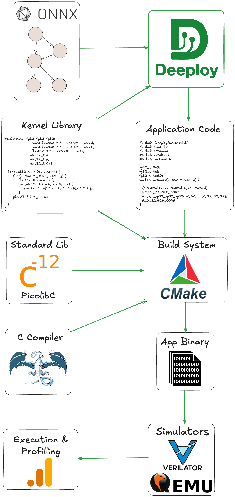

<div style="display: flex; justify-content: space-between; align-items: center;">
  
  <div style="text-align: right;">
    <p>Institut für Integrierte Systeme <br>
    Integrated Systems Laboratory</p>
  </div>
</div>


# SoCDAML: Neural Network Deeployment on the PULP Platform
Author: *Victor J.B Jung* <br>
Date: 27th May 2025

## Installation

A Deeploy Singularity container has been installed on your home directory, it should be a folder named `DeeployContainer`. You can find the `Deeploy` source code under `~/DeeployContainer/app/Deeploy`.

To enter a shell from the conatainer, from your home, simply run `singularity shell --writable --cleanenv --contain DeeployContainer`. Then you can naviguate to the `DeeployTest` folder with `cd /app/Deeploy/Deeploytest`.

From the `DeeployTest` folder you can use the `testRunner` to compile ONNXs and execute the output code with the appropriate simulators.

To validate that your install is correct you can run a simple Add node on each platform:
```
python testRunner_generic.py -t Tests/Adder
python testRunner_cortexm.py -t Tests/Adder
python testRunner_mempool.py -t Tests/Adder
python testRunner_snitch.py -t Tests/Adder/ --toolchain_install_dir /app/install/riscv-llvm/ --simulator=banshee
python testRunner_snitch.py -t Tests/Adder/ --toolchain_install_dir /app/install/riscv-llvm/ --simulator=gvsoc
python testRunner_siracusa.py -t Tests/Adder --cores=8
```
Once all these basic tests are passing, we can jump into the basics of Deeploy. 

## I: Deeploy 101

Paragraph to introduce Deeploy's I/O



- Format of the tests and how to visualize the ONNX using Netron
    - Visualize Add
    - Visualize ResNet
    - Visualize MicroLlama
- Look at the generated code for the Adder on Generic -> Point at the Add kernel template in Deeploy

## II: Tiny Llama on Siracusa

- Explain the impact of the arguments of the command line for executing tiny llama on Siracusa
- Save the profiling traces for several networks in several modes
- Some questions for the students:
  - When using NEUREKA, why do we observe a higher speedup in parallel model compared to autoregressive mode?
  - Why is the impact of the NMS higher in autoregressive mode compared to parallel mode?

## III: Visualizing and Understanding Tiling and Memory Allocation


<details>
  <summary>Click to reveal the solution</summary>

  **Solution:**  
  The derivative of `x^2` is `2x`.
</details>

**Your answer:**

```markdown
# Write your answer here:
