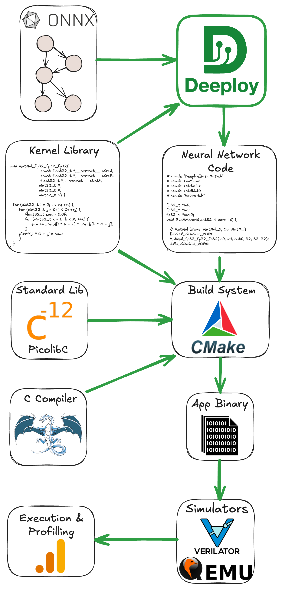

<div style="display: flex; justify-content: space-between; align-items: center;">
  
  <div style="text-align: right;">
    <p>Institut für Integrierte Systeme <br>
    Integrated Systems Laboratory</p>
  </div>
</div>


# SoCDAML: Neural Network Deeployment on the PULP Platform
Author: *Victor J.B Jung* <br>
Date: 27th May 2025

## Installation

A Singularity container with Deeploy and its dependencies has been installed on your home directory, it should be a folder named `DeeployContainer`. You can find the `Deeploy` source code under `~/DeeployContainer/app/Deeploy`.

To enter a shell from the container, from your home, simply run `singularity shell --writable --cleanenv --contain DeeployContainer`. Then you can naviguate to the `DeeployTest` folder with `cd /app/Deeploy/Deeploytest`.

From the `DeeployTest` folder you can use the `testRunner` to compile ONNXs and execute the output code with the appropriate simulators.

To validate that your install is correct you can run a simple Add node on each platform:
```
python testRunner_generic.py -t Tests/Adder
python testRunner_cortexm.py -t Tests/Adder
python testRunner_mempool.py -t Tests/Adder
python testRunner_snitch.py -t Tests/Adder/ --toolchain_install_dir /app/install/riscv-llvm/ --simulator=banshee
python testRunner_snitch.py -t Tests/Adder/ --toolchain_install_dir /app/install/riscv-llvm/ --simulator=gvsoc
python testRunner_siracusa.py -t Tests/Adder --cores=8
```
Once all these basic tests are passing, we can jump into the basics of Deeploy. 

## I : Deeploy 101

Deeploy is a compiler that transforms static computational graph (represented with the [ONNX format](https://onnx.ai/onnx/operators/)) into baremetal and (hopefully) optimized [C](https://www.c-language.org/). More specifically, it generates an application than can then be deployed on the desired platform.

Hence, Deeploy's inputs are:
- An ONNX file describing your neural network.
- Input tensors.
- Expected output tensors generated with your favorite framework (ONNXRuntime or Torch for instance).

Deeploy is shipped with a comprehensive testing framework conveniently named DeeployTest. This testing framework contains Test Runners for end-to-end testing of your network on a given platform. More specifically, a Test Runner compiles a given ONNX file, builds the project, feed the given inputs into the compiled neural network, and compare the output with the golden values to ensure correctness.

If you followed this tutorial correctly, you already used Test Runners (e.g. `testRunner_siracusa.py`) to validate the Deeploy installation! We will dive into the details of the Test Runners CLI very soon, but first let's take a look at the tools and libraries used downstream of Deeploy.

The figure below gives an overview of the deployment stack, as you can see, there are several steps before actually running the application. For the build system (*e.g.* the tool to organize compilation and linking), we use [CMake](https://cmake.org/). The default C compiler shipped with Deeploy is [LLVM 15](https://llvm.org/), but it supports GCC given that you provide a local installation. To generate the Application Binary, we link the Network Code with the necessary Kernel Libraries and a Standard C Library (here [Picolibc](https://github.com/picolibc/picolibc)). Then we feed this Application Binary to the appropriate simulator, from there you can verify correctness and benchmark the application.

<p align="center">
    
</p>

You can visualize the ONNX graphs using [Netron](https://netron.app/). Either use the webinterface or install the python package with `pip install netron`.

> ✅ **Task:** Visualize the ONNX graph of the `Adder`, `MobileNetv2`, and `Transformer` 

You can find the ONNX graphs in `DeeployTest/Tests/<TestName>/network.onnx`. The networks are increasing in complexity, `Adder` is a single node network for unit testing, while `MobileNetv2` is a simple sequential network mostly made of convolutions. Finally the `Transformer` network showcase a typical transformer block used both in Encoder or Decoder networks. If you want to peek at a very complex network, you can visualize `microLlama/microLlama128`.

Now that we understand Deeploy's input, let's check the output generated code!

> ✅ **Task:** Take a look at the code generated by Deeploy for the Generic platform.

The generated code is located in the following directory: `DeeployTest/TEST_<PlatformName>` and the `Network.c` file is the interesting one. 

For the `Adder` graph, the generated code is trivial, we simply use the template for the `Add` node of the Generic platform. You can find the template declaration in `Deeploy/Targets/Generic/Templates/AddTemplate.py`.

Now if you want to look at something a bit more complex, run `python testRunner_generic.py  -t ./Tests/miniMobileNetv2` (from `DeeployTest`) and take a look at the generated code. There are two interesting points you can notice:
- We hoist the constants at the top of the file.
- Then in the `RunNetwork` function, we sequentially have node templates to execute the operands and malloc/free to manage the memory. You can open the ONNX graph of `miniMobileNetv2` on the side to try to match nodes of the graph with their generated code.

> ✅ **Task:** Visualize the effect of passes on the ONNX graph for the Siracusa platform.

Deeploy applies passes on the ONNX graph to transformer its topology in order to optimize its execution. Let's visualize the effect of the passes used in the Siracusa Platform. First, let's execute our `miniMobileNetv2` on Siracusa with `python testRunner_siracusa.py  -t ./Tests/miniMobileNetv2`. You can find the original ONNX graph at `Tests/miniMobileNetv2/network.c`, and the transformed ONNX graph at `DeeployTest/TEST_SIRACUSA/Tests/miniMobileNetv2/deeployStates/backend_post_binding.onnx`. Open both ONNX graphs side by side to compare them.

You can notice the effect of two passes on the graph:
- One pass is fusing the `Conv` and `RequantShift` nodes. This is a common technique named [Operator Fusion](https://medium.com/data-science/how-pytorch-2-0-accelerates-deep-learning-with-operator-fusion-and-cpu-gpu-code-generation-35132a85bd26) and used in many DNN compilers.
- Another pass is adding a `Transpose` node before the `RequantizedConv` in order to align the tensor layout from CHW to HWC (where C = Channels, H = Height, and W = Width). The HWC tensor layout is required to use optimized Convolution kernels (to learn more, check out [this blog post](https://www.intel.com/content/www/us/en/developer/articles/technical/pytorch-vision-models-with-channels-last-on-cpu.html)).

Now that you understand the basics of Deeploy, let's jump into the optimized deployment of a small language model on the Siracusa SoC.

## II : Tiny Llama on Siracusa

<!-- Quickly introduce TinyLLama, autoregressive and parallel mode. -->
In this section, we will study the optimization of the deployment of a small language model. To fully understand this section, you need some basic understanding of Transformer's architecture and Language Model inference mode. If you need a refresher of Transformer's architecture check out the *Transformer Basics* section of [Lilian Weng's blog post](https://lilianweng.github.io/posts/2023-01-27-the-transformer-family-v2/#transformer-basics). 

Now, Language Models have two inference modes:
- The **Parallel Mode** (AKA *Prefill Mode*) is used to process in parallel the tokens of the prompts and generate the KV cache of the prompt as well as the first token of the Language Model's "reply". This mode contains mostly GEMMs.
- The **Autoregressive Mode** is used to generate the rest of the Language Model's reply. It's using the KV cache from the previous step, generates a new KV cache entry, and predicts the next token. This mode contains mostly GEMVs.

To summarize, to generate a Language Model reply of $N$ tokens, there is: 
- One **Parallel Mode** inference to process the prompt and generate the first token.
- $N-1$ **Autoregressive Mode** inferences to generate the rest of the tokens. 

The slide below provides a visual representation to the **Parallel Mode** and **Autoregressive Mode**.

<p align="center">
    
</p>

Let's also quickly refresh our knowledge of the Siracusa platform to understand what kind of hardware we are tying to deploy on. Below is the high-level block diagram of Siracusa, compute-wise we will mainly use:
- The cluster of RV32 cores, they are modified to be great at crunching numbers. They feature [SIMD](), hardware loops (see the [RI5CY user manual](https://www.pulp-platform.org/docs/ri5cy_user_manual.pdf), p17), and the [XPULP](https://pulp-platform.org/docs/hipeac/acaces2021/04_PULP_Accelerators.pdf) ISA extensions.
- The [NEUREKA](https://github.com/pulp-platform/neureka) NPU, an accelerator targeting integer convolutions.

In terms of memories, we have:
- L3: An off-chip RAM (not shown on the block diagram) of 16MB capacity. The L3 has it's own DMA that can transfer data to L2.
- Weight Memory: An SRAM/MRAM-based *Weight Memory* to store constants and with a directly link to the NPU.
- L2: An on-chip SRAM-based L2 memory of 2MB.
- L1: A TCDM memory of size 256KB.

The on-chip DMA indicated on the block diagram can transfer data between the Weight Memory, the L2, and the L1.


<p align="center">
    
</p>

Now that you understand the hardware and the kind of workload we want to execute. Let's deploy using various optimizations to study their impact. The first parameter we can play with is the number of cores from the RV32 cluster to use.

> ✅ **Task:** Measure and compare the runtime of the `microLlama128` model using 1 and 8 cores. Compute the speedup ratio, why is it not 8?

*Hint:* `python testRunner_siracusa.py --help` will list and explain the available flags.

<details>
  <summary>Solution</summary>

  If you run `python testRunner_siracusa.py -t Tests/microLlama/microLlama128 --cores=1` and then `python testRunner_siracusa.py -t Tests/microLlama/microLlama128 --cores=8`, you should measure a runtime of ~16,1M cycles for 1 core and 3.1M cycles for 8 cores.

  The speedup ratio is obtained via $\frac{\text{Runtime 1 cores}}{\text{Runtime 8 cores}} = 5.2$. Hence, using 8 cores instead of 1 leads to a 5.2 times speedup.

  So why is the speedup ratio below 8? Mostly because all data movement is not overlapped with computation. Additionally, some kernels are probably not optimally parallelized for this specific network.
</details>


<!-- Explain the difference between tiled and non-tiled execution, ask them to see the difference in the runtime.  -->


<!-- - Explain the impact of the arguments of the command line for executing tiny llama on Siracusa
- Save the profiling traces for several networks in several modes
- Some questions for the students:
  - When using NEUREKA, why do we observe a higher speedup in parallel model compared to autoregressive mode?
  - Why is the impact of the NMS higher in autoregressive mode compared to parallel mode? -->

## III : Visualizing and Understanding Tiling and Memory Allocation


<details>
  <summary>Click to reveal the solution</summary>

  **Solution:**  
  The derivative of `x^2` is `2x`.
</details>

**Your answer:**

```markdown
# Write your answer here:
